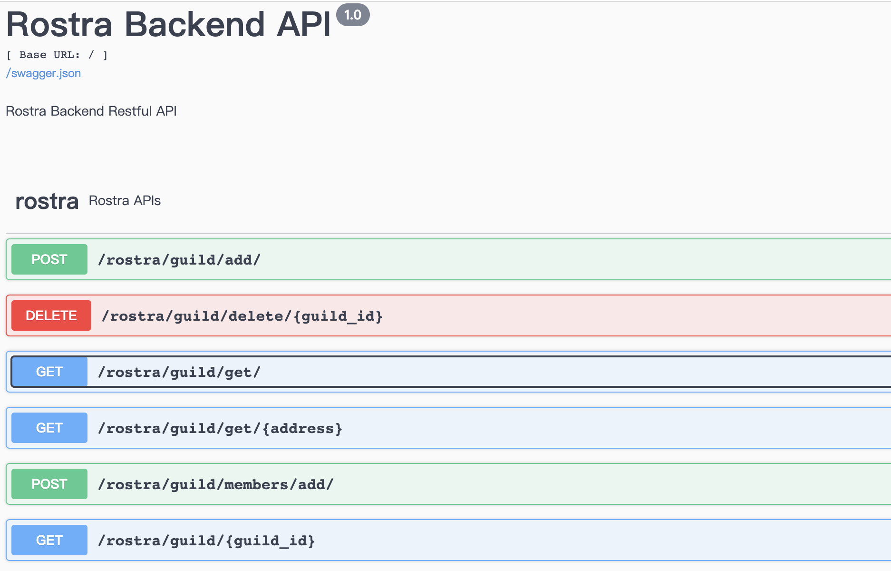

# Rostra-Backend
Use flask to provide restful api  for rostra app

## Requirements
- Flask
- [MongoDB](https://docs.mongodb.com/manual/installation/)
- Python 3.7

### Installed Packages

    pip install Flask
    pip install flask_mongoengine
    pip install flask-restx
    pip install flask-cors

## Start 

    flask run
    
If you run the code below and visit your API’s root URL (http://localhost:5000) you can view the automatically-generated Swagger UI documentation.

The API Provided is as list in the pic below

## Deploy

    1. pip install gunicorn
    2. run the start.sh script
    

    
